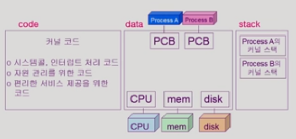
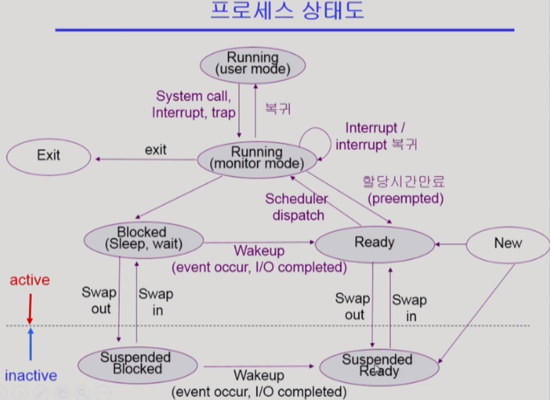
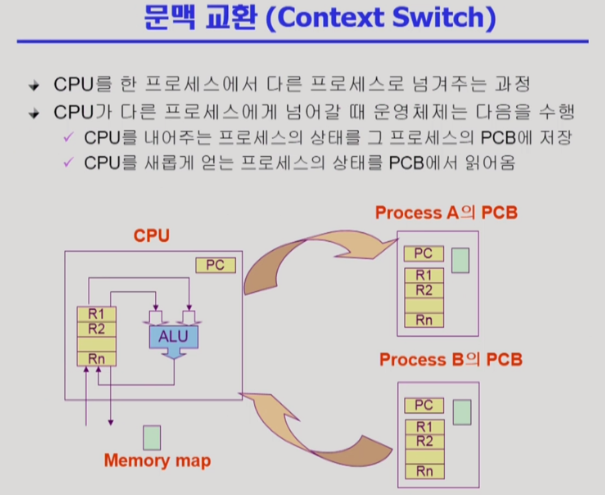
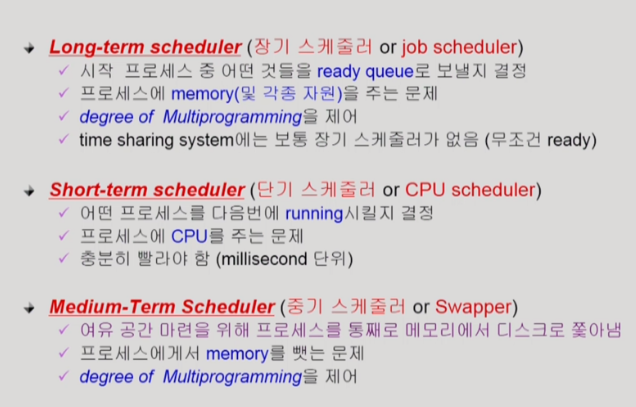

# Operating System 
*** 
 
  
# 1주차 ( 2019. 04. 14 )
## 1. Process 
### 학습목표 
##### >1. 메모리 구조에 대해 설명할 수 있다. 
##### >2. 프로세스의 상태도를 그리고 설명할 수 있다. 
##### >3. Context Switching에 대해 설명할 수 있다. 
##### >4. 운영체제의 스케줄러에 대해 설명할 수 있다. 
##### >5. System Call에 대해 설명할 수 있다. 
##### >6. 대표적인 System Call인 fork와 exec , abort에대해 설명할 수 있다. 
*** 
###### 해당 내용은 https://core.ewha.ac.kr/publicview/C0101020140318134023355997?vmode=f 를 참고, 발췌하였습니다.
 
  
 
```
    1. 메모리구조  
    메모리 구조는 크게 stack, heap, code, data 영역으로 나누어져 있습니다. 
    stack 영역은 임시메모리영역으로 지연변수,매개변수,리턴 값 등이 저장되는 공간입니다. 
    data 영역은 전역변수,정적변수,배열,구조체와같은 메모리주소공간입니다. 
    heap 영역은 동적메모리 할당에 관한 메모리에 관한 영역입니다. 
    커널 또한 하나의 프로세스이기 때문에 이와 같은 메모리 공간을 가지고 있습니다.

``` 
 
 
 
```
    2. 프로세스의 상태
    프로세스는 new, ready, running, wait(blocked), suspended 의 상태를 거쳐 소멸된다. 
    프로세스가 생성 되면 스케줄러에의해 ready상태(queue)로 진입하게되어 실행이 될 준비를 마친다. 
    그 후 cpu를 사용할 수 있는 권한을 얻게되면 running으로 이동해 instuction을 수행한다. 
    running과정에서 IO작업과 같은 cpu가 필요없는 상황에서는 작업의 효율을 위해, 잠시 wait상태로 
    이동하여 cpu를 양보한다. 이후 IO작업이 완료되면, 다시 ready로 이동하여 cpu를 사용할수있을때까지 
    대기상태를 유지한다. 
    또한, 프로세스는 ready와 running상태를 오갈수있는데 하나의 프로세스가 cpu를 독점하는 것을 막기위해 
    timer를 두고, 일정시간마다 interupt를 걸어 주어진 시간동안만 cpu를 이용하고, ready로 이동하게된다. 
    suspened상태는 wait상태와 마찬가지로 cpu제어권이 없는 상태지만, wait상태와 달리 메모리를 비워두고 
    일시정시상태에 들어가는것을 의미한다. 
```
 

```
    3. context switching
    현대 컴퓨터는 하나의 프로세스만 사용하는 것이아닌 다중프로세스를 지원하고있고 ,time-sharing을 통해 
    사용자가 동시에 여러작업을 할수있도록 지원한다. 따라서 프로세스A가 실행되면서 프로세스B를 실행하기위해 
    한정된 자원인 cpu를 번갈아가며 사용하게된다. 이 때 cpu가 프로세스의 어디까지 실행했는가를 기억해둬야지만 
    다시 그 프로세스가 cpu를 얻었을때 그시점부터 동작할수있게된다. 이를 위해 PCB(process controll block)이라는 
    자료구조가 존재하고, PCB에 다양한 프로세스의 정보가 저장되어진다. 프로세스A가 프로세스B에게 자리를 양보할 때 
    PCB에 이러한 문맥을 저장해두고, cpu는 프로세스B의 PCB를 불러와 instruction을 수행한다. 이러한 문맥교환을 
    context swithing이라 한다. 
```
 
 
 ```
     4. 스케줄러
     
 ```
     
